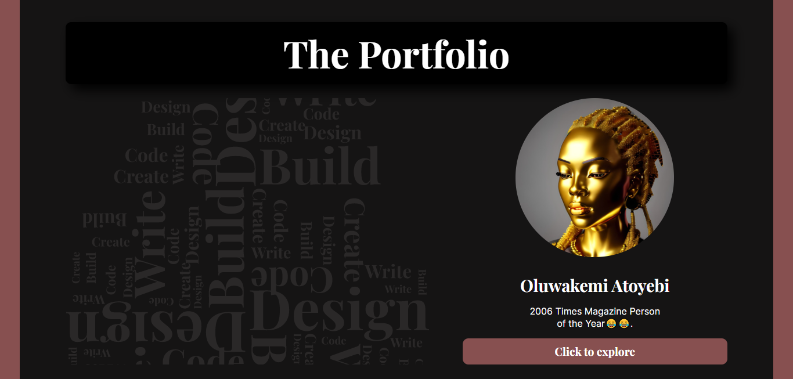
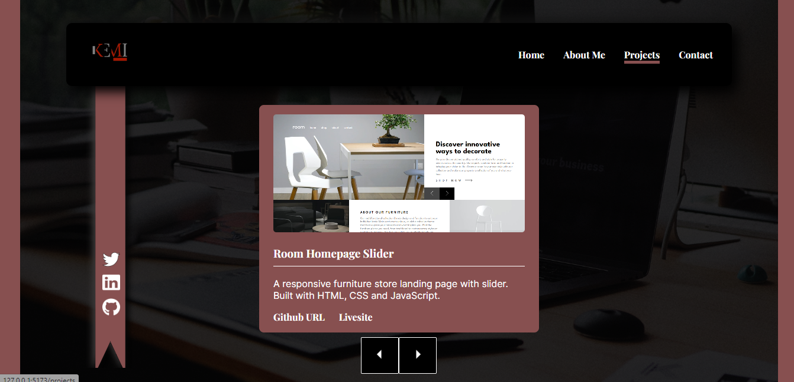

## Portfolio Site

A personal portfolio site to showcase my skills, past projects and experiences as a frontend developer who is interested in the potentials of Web3 and blockchain technologies. The design was created to look like a magazine with a coverpage and then the inner pages. I am open to feedback and constructive criticism on how to make this better.

## Resources

* FormSubmit API
* Mailto links

## Built with

* React
* CSS flexbox
* React Routers
* React Hooks
* Figma

## Screenshots

## Links

[Livesite](https://oluwakemi-atoyebi-portfolio.netlify.app/)

[Design](https://www.figma.com/file/25LLwl1u8l89fmBZ2xQVdf/Portfolio-site?node-id=0%3A1&t=3qKm82P4mm06HnzU-1)

[Github-URL](https://github.com/Khemmie-Ray/Portfolio-Site.git)

## Author

Atoyebi Oluwakemi.